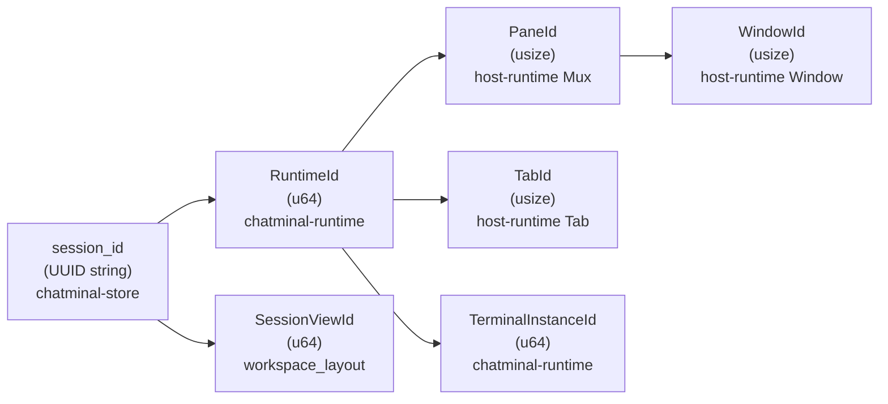

# Phân Tích Dư Thừa Kiến Trúc Chatminal (Fork từ WezTerm)

## Tóm tắt

Dự án có **3 vùng dư thừa chính** do fork từ WezTerm rồi xây lớp product (profile-session) lên trên mà chưa loại bỏ hết lớp engine cũ: **split layout song song**, **identity mapping chồng chéo**, và **data type trùng lặp qua 3 tầng**.

**Status (2026-03-17 after Phase 2 complete):**
- ✅ **Phase 1 (Tier 1 cleanup)**: 4 SSH/tmux/remote crates + 5 modules deleted; sealed engine split path; localized ID mapping to desktop
- ✅ **Phase 2.1 - Type unification**: 17 Runtime* types merged as type aliases to chatminal-protocol; api/protocol.rs (431 LOC) **deleted**; 5 Store→Protocol From impls moved to chatminal-store
- ✅ **Phase 2.2 - Engine split fallback removal**: `split_terminal_handle` + `split_terminal_handle_by_public_id` deleted from `desktop_host_runtime/mod.rs`; `SplitSource` type alias removed; `desktop_spawn.rs:111-131` split fallback replaced with `anyhow::bail!`
- ✅ **Phase 2.3 - Dead code cleanup**: 4 dead functions removed (`active_host_domain_name`, `set_default_host_domain`, `new_headless_connection_ui`, `host_client_domains`); 3 unused type aliases removed (`RuntimeSplitDirection`, `RuntimeSplitRequest`, `RuntimeSplitSize`); ~33 LOC removed
- ✅ **Phase 2.4 - Workspace layout persistence**: Already implemented via `set_string_state`/`get_string_state` (no action needed)
- ✅ **Phase 2.5 - Documentation**: window.rs documented (single-Window/single-Tab desktop model); architecture-analysis.md updated

---

## 1. Split Layout Song Song (Nghiêm trọng nhất)

Hiện tại có **2 hệ thống split layout hoàn toàn tách biệt** cùng tồn tại:

| | WezTerm Engine (cũ) | Chatminal Product (mới) |
|---|---|---|
| **File** | [tab.rs](file:///Users/khoa2807/development/2026/chatminal/crates/chatminal-host-runtime/src/tab.rs) (2529 dòng) | [workspace_layout.rs](file:///Users/khoa2807/development/2026/chatminal/crates/chatminal-runtime/src/workspace_layout.rs) (560 dòng) |
| **Data structure** | `bintree::Tree<Arc<dyn Pane>, SplitDirectionAndSize>` | `WorkspaceLayoutState { nodes, views }` |
| **Split types** | `SplitDirection::Horizontal/Vertical` | `WorkspaceSplitAxis::Horizontal/Vertical` |
| **Split op** | `Tab::split_and_insert()` | `WorkspaceLayoutState::split_view()` |
| **Close op** | `Tab::remove_pane()` / `Tab::kill_pane()` | `WorkspaceLayoutState::close_view()` |
| **Resize** | `Tab::resize_split_by()` | `WorkspaceLayoutState::resize_split()` |
| **Focus** | `Tab::set_active_pane()` | `WorkspaceLayoutState::focus_view()` |

> [!CAUTION]
> Hai hệ thống split này phải luôn sync với nhau qua `desktop_host_runtime` adapter. Bất kỳ bug nào ở lớp adapter đều gây desync giữa UI layout và engine layout.

---

## 2. Identity Mapping Chồng Chéo

Mỗi session có **tối thiểu 5 loại ID** khác nhau qua các layer:

- `Mux.chatminal_session_id_index` (line 124 lib.rs) — reverse index từ `session_id` → `PaneId` 
- `desktop_host_runtime` phải duy trì mapping 2 chiều giữa Chatminal `session_id` ↔ engine `PaneId/TabId`
- `RuntimeExecutionAdapter.attachment()` tra ngược từ `session_id` → `(RuntimeId, TerminalInstanceId)`

> [!WARNING]
> Mỗi khi tạo/đóng/switch session, code phải update **cả 2 hệ thống** — Chatminal store/workspace VÀ WezTerm Mux/Tab/Pane.

---

## 3. Data Types Trùng Lặp Qua 3 Tầng (Partially Resolved)

**Phase 2.1 Progress:** 17 types unified via type aliases → chatminal-protocol only, eliminating conversion boilerplate.

**Remaining**: Store-level types still differ from Protocol (Store adds `shell` field, extends enums):

| Concept | Store | Runtime (Protocol alias) | Conversion |
|---|---|---|---|
| Session | `StoredSession` (7 fields) | `RuntimeSession = SessionInfo` (6 fields) | via `From` impls (moved to chatminal-store in Phase 2.1) |
| Session Status | `StoredSessionStatus` enum | `RuntimeSessionStatus = SessionStatus` enum | via `From` impls in chatminal-store |
| Profile | `StoredProfile` | `RuntimeProfile = ProfileInfo` | via `From` impl in chatminal-store |
| SessionSnapshot | `StoredSessionSnapshot` | `RuntimeSessionSnapshot = SessionSnapshot` | direct alignment |

Previous state: 3 full data type hierarchies (Store + Protocol + Runtime definitions). Now only 2 (Store + Protocol), Runtime layer is pure type aliases.

---

## 4. WezTerm Engine Crates Còn Giữ Nguyên

Trong 61 crates, nhóm `chatminal-engine-*` (khoảng **20 crates**) và `chatminal-host-runtime` gần như là WezTerm code rename package:

| Crate gốc WezTerm | Crate hiện tại | Dòng code | Ghi chú |
|---|---|---|---|
| `wezterm-mux-server-impl` | `chatminal-engine-mux-server-impl` | — | Mux server |
| `wezterm-term` | `chatminal-engine-term` | — | Terminal engine |
| `wezterm-font` | `chatminal-engine-font` | — | Font rendering |
| `wezterm-gui-subcommands` | `chatminal-engine-gui-subcommands` | — | GUI CLI |
| `wezterm-ssh` | `chatminal-engine-ssh` | — | SSH support |
| `wezterm-client` | `chatminal-engine-client` | — | Remote client |
| Mux crate (wezterm) | `chatminal-host-runtime` | **1510+ dòng** (lib.rs alone) | **Mux/Tab/Pane/Window/Domain** |

> [!IMPORTANT]
> Nhiều crate engine chỉ được `chatminal-desktop` sử dụng và không phải core business logic. Một số feature (SSH, tmux, remote domain) có thể chưa bao giờ được dùng trong context Chatminal.

---

## 5. Các Vùng Dư Thừa Cụ Thể Khác

### `chatminal-terminal-core` vs `chatminal-engine-term`
- `chatminal-terminal-core` (211 dòng): wrapper VT100 đơn giản dùng crate `vt100`
- `chatminal-engine-term`: full WezTerm terminal engine (termwiz-based)
- **Cả 2 đều là terminal parser** — desktop dùng engine-term, daemon dùng terminal-core

### `chatminal-session-runtime` — Ghost crate ✅ Resolved (Phase 3.1)
- Đã inline vào `desktop_host_runtime::session_engine`
- Tất cả 12 ghost references trong comments đã được cập nhật

### `third_party/terminal-engine-reference` ✅ Resolved (Phase 3.2)
- Đã xóa ~3GB WezTerm reference snapshot
- Cargo.toml exclude line và README references đã được cập nhật

---

## Tổng kết mức độ nghiêm trọng

| Vấn đề | Nghiêm trọng | Status | Ghi chú |
|---|---|---|---|
| **Split layout song song** | 🔴 Cao | ⚠️ Partial | Tab split code (split_and_insert, compute_split_size) **cannot be removed** — lua-bridge still calls Mux::split_pane → Domain::split_pane → tab functions. Desktop only uses WorkspaceLayoutState. |
| **Identity mapping 5 loại ID** | 🔴 Cao | ⏳ Future | Desktop layer simplified; core mapping still complex at engine/daemon level |
| **Data types trùng 3 tầng** | 🟡 Trung bình | ✅ Phase 2.1 | Runtime layer fully eliminated; Store↔Protocol conversion moved to chatminal-store |
| **Ghost crate references** | 🟢 Thấp | ✅ Phase 1 | All ghost `chatminal-session-runtime` references cleaned |
| **Unused engine features** | 🟡 Trung bình | ✅ Phase 1 | SSH/tmux/remote crates deleted; SSH domain creation removed |
| **Duplicate terminal parser** | 🟡 Trung bình | ⏳ Future | Both vt100 (daemon) and termwiz (desktop) still in use; split by target |
| **third_party reference** | 🟢 Thấp | ✅ Phase 1 | ~3GB WezTerm reference snapshot deleted |
| **Engine split fallback** | 🔴 Cao | ✅ Phase 2.2 | Fully removed; desktop_spawn.rs fallback replaced with error |
