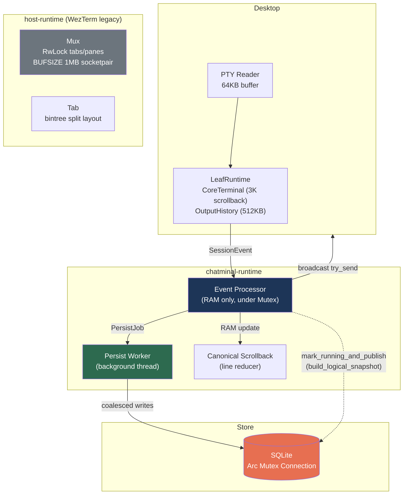

# Chatminal Architecture — Deep Re-scan Report (2026-03-31)

## 1. Data Flow Architecture



---

## 2. Modules Scanned (15+ files, ~10K LOC)

| Module | LOC | Status |
|---|---|---|
| [store/lib.rs](file:///Users/khoa2807/development/2026/chatminal/crates/chatminal-store/src/lib.rs) | 1692 | ✅ Shared conn, SQL retention |
| [state.rs](file:///Users/khoa2807/development/2026/chatminal/crates/chatminal-runtime/src/state.rs) | 1663 | ✅ Persist worker wired |
| [host-runtime/lib.rs](file:///Users/khoa2807/development/2026/chatminal/crates/chatminal-host-runtime/src/lib.rs) | 1144 | ⚠️ WezTerm legacy |
| [desktop_host_runtime/mod.rs](file:///Users/khoa2807/development/2026/chatminal/apps/chatminal-desktop/src/desktop_host_runtime/mod.rs) | 749 | ✅ Adapter layer |
| [canonical_scrollback.rs](file:///Users/khoa2807/development/2026/chatminal/crates/chatminal-runtime/src/state/canonical_scrollback.rs) | 489 | ⚠️ Vec\<char\> per line |
| [startup_recipe.rs](file:///Users/khoa2807/development/2026/chatminal/crates/chatminal-runtime/src/state/startup_recipe.rs) | 302 | ✅ Thread-based polling |
| [leaf_runtime.rs](file:///Users/khoa2807/development/2026/chatminal/apps/chatminal-desktop/src/desktop_host_runtime/session_engine/leaf_runtime.rs) | 297 | ✅ scrollback 3K |
| [persist_worker.rs](file:///Users/khoa2807/development/2026/chatminal/crates/chatminal-runtime/src/state/persist_worker.rs) | 250 | ✅ Coalescing clean |
| [session_event_processor.rs](file:///Users/khoa2807/development/2026/chatminal/crates/chatminal-runtime/src/state/session_event_processor.rs) | 212 | ✅ Throttle /50 |
| [runtime_bridge.rs](file:///Users/khoa2807/development/2026/chatminal/crates/chatminal-runtime/src/state/runtime_bridge.rs) | 202 | ✅ Clean trait boundary |
| [output_history.rs](file:///Users/khoa2807/development/2026/chatminal/apps/chatminal-desktop/src/desktop_host_runtime/session_engine/output_history.rs) | 76 | ✅ 512KB cap |
| [metrics.rs](file:///Users/khoa2807/development/2026/chatminal/crates/chatminal-runtime/src/metrics.rs) | 70 | ✅ Lock-free AtomicU64 |

---

## 3. Optimizations Completed

| Phase | Change | File | Impact |
|---|---|---|---|
| **1** | Shared SQLite connection | `store/lib.rs` | -40 syscalls/cycle |
| **2** | Async persist worker + coalescing | `persist_worker.rs` | **0 SQLite under lock** |
| **2** | `live_output` 1MB→256KB | `session_event_processor.rs` | -75% |
| **3** | SQL window function retention | `store/lib.rs` | RAM O(N)→O(1) |
| **4** | `scrollback_size` 10K→3K | `leaf_runtime.rs:65` | **-70% RAM** |
| **4** | `OutputHistory` 2MB→512KB | `output_history.rs:5` | -75% |
| **4** | `EnforceLimit` throttle /50 | `session_event_processor.rs:161` | -98% disk I/O |

---

## 4. New Findings (chưa phát hiện trước đó)

### 4.1. `build_logical_snapshot` — full record load under lock 🔴

Tại [runtime_bridge.rs:178](file:///Users/khoa2807/development/2026/chatminal/crates/chatminal-runtime/src/state/runtime_bridge.rs#L178), `mark_session_running_and_publish` gọi `build_logical_snapshot` **dưới global `StateInner` lock**.

`build_logical_snapshot` ([canonical_scrollback.rs:56-147](file:///Users/khoa2807/development/2026/chatminal/crates/chatminal-runtime/src/state/canonical_scrollback.rs#L56-L147)) loads **toàn bộ scrollback records** từ SQLite + xử lý in-memory → potential **latency spike** nếu session có nhiều history.

> [!CAUTION]
> Đây xảy ra mỗi khi reattach session (disconnect → reconnect). Tất cả operations khác bị block trong thời gian này.

### 4.2. `BUFSIZE = 1MB` socketpair trong Mux 🟡

Tại [host-runtime/lib.rs:115](file:///Users/khoa2807/development/2026/chatminal/crates/chatminal-host-runtime/src/lib.rs#L115):

```rust
const BUFSIZE: usize = 1024 * 1024; // 1 MB
```

Mỗi pane spawns 2 threads + 1MB socketpair buffer. **Per session**: 1MB read buffer + 1MB socketpair = ~2MB overhead ngoài scrollback.

### 4.3. `Vec<char>` per line trong LogicalReducer 🟢

[canonical_scrollback.rs:276](file:///Users/khoa2807/development/2026/chatminal/crates/chatminal-runtime/src/state/canonical_scrollback.rs#L276):

```rust
struct LogicalReducer {
    current_line: Vec<char>,  // 4 bytes/char thay vì 1
    ...
}
```

Mỗi character tốn 4 bytes (char = 4 bytes) thay vì 1 byte (UTF-8 average). Overhead ~3x cho text thuần ASCII. Chỉ ảnh hưởng khi build snapshot.

---

## 5. Resource Footprint (Updated)

| Component | Per Session | 5 Sessions |
|---|---|---|
| CoreTerminal scrollback (3K) | ~22MB | ~110MB |
| Mux socketpair + read buffer | ~2MB | ~10MB |
| OutputHistory | 512KB | 2.5MB |
| live_output | 256KB | 1.25MB |
| **Total** | **~25MB** | **~124MB** |

---

## 6. No Resource Leaks ✅

- PTY: `kill()` on Drop
- Subscriber: auto unsubscribe on Drop
- Persist thread: orderly `Shutdown` + `thread.join()`
- SQLite: shared `Arc<Mutex<Connection>>`
- Bounded buffers: OutputHistory (512KB), live_output (256KB)

---

## 7. Recommendations

| # | Action | Impact | Effort |
|---|---|---|---|
| 🔴 1 | Move `build_logical_snapshot` ra ngoài global lock | Bỏ latency spike khi reattach | Medium |
| 🟡 2 | `output_chunk` → `Arc<str>` zero-copy | Giảm 2-3 clones/event | Medium |
| 🟡 3 | Cache `workspace_load` result | Bỏ full table scan | ~30 LOC |
| 🟢 4 | Audit/prune dead engine crates | Giảm binary, compile | Large |
| 🟢 5 | Giảm `BUFSIZE` từ 1MB → 256KB | -1.5MB/session | 1 dòng |

> **Kết luận**: Kiến trúc runtime rất tốt. Bottleneck lớn nhất còn lại là `build_logical_snapshot` under lock (recommendation #1). Tech debt chính là 57 legacy WezTerm crates.
